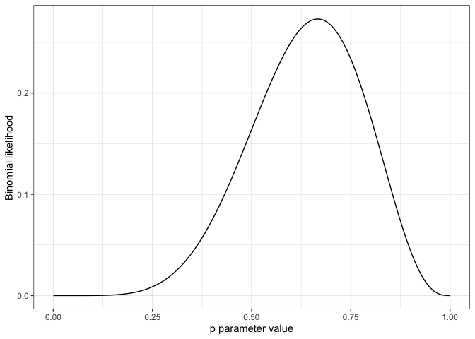

McElreath Statistical Rethinking 2e Chapter 2
================

Load libraries

``` r
library(tidyverse)
```

    ## ── Attaching packages ─────────────────────────────────────── tidyverse 1.3.0 ──

    ## ✓ ggplot2 3.3.2     ✓ purrr   0.3.4
    ## ✓ tibble  3.0.1     ✓ dplyr   1.0.0
    ## ✓ tidyr   1.1.0     ✓ stringr 1.4.0
    ## ✓ readr   1.3.1     ✓ forcats 0.5.0

    ## ── Conflicts ────────────────────────────────────────── tidyverse_conflicts() ──
    ## x dplyr::filter() masks stats::filter()
    ## x dplyr::lag()    masks stats::lag()

# Introduction

Columbus example: making assumptions based on a small world that don’t
ending up holding in the large world.

Small world - self-contained logical world of the model. Bayesian models
make the best use of information in the data under the assumption that
the small world is an accurate description

Large world - broader context, “logical consistency of the small world
is no guarantee that it will be optimal in the large world.”

This chapter is a focus on the small world. Here probability theory is
shown as “counting the ways things can happen.”

# 2.1 The garden of forking data

Example of the “Garden of forking paths” “Bayesian inference is really
just counting and comparing possibilities”

“This approach guarantees the right answer in small world terms.”

## 2.1.1 Counting possibilities

We are working with marbles where there are only white and blue marbles
and we know that there are four in the bag. What we want to try to
figure out is how many of each color are in the bag.

Let’s represent white as 0 and blue as 1 and show all the possibilities
of the four marbles

``` r
(d <- tibble(p_1 = 0,
            p_2 = rep(1:0, times = c(1,3)),
            p_3 = rep(1:0, times = c(2,2)),
            p_4 = rep(1:0, times = c(3,1)),
            p_5 = 1))
```

    ## # A tibble: 4 x 5
    ##     p_1   p_2   p_3   p_4   p_5
    ##   <dbl> <int> <int> <int> <dbl>
    ## 1     0     1     1     1     1
    ## 2     0     0     1     1     1
    ## 3     0     0     0     1     1
    ## 4     0     0     0     0     1

We can show this similar to how McElreath does in graphical form.

``` r
d %>%
    # convert from wide to long format
    gather()  %>%
    # add the label for p_1 to p_5 and the draw number as x
    mutate(x = rep(1:4, times =5),
            possibility = str_c("P_", rep(1:5, each=4))) %>%
    # plot the values as circles
    ggplot(aes(x=x, y=possibility,
                fill=value %>% as.character())) +
    geom_point(shape=21, size=5) +
    # change the color to match McElreath's
    scale_fill_manual(values = c("white", "navy")) +
    coord_cartesian(xlim = c(0.75, 4.25),
                    ylim = c(0.75, 5.25)) + theme_bw() +
    labs(y = "Conjecture", x = "Marble") +
    theme(legend.position="none")
```

<!-- -->

Here the possibilities are in the columns and the draws are in the rows.
McElreath calls these *conjectures*.

“Our goal is to figure out which of these conjectures is most plausible,
given some evidence”

We will start by considering just one conjecture that is P\_2 above.
Under this conjecture let’s draw one marble.

For the first draw only one of four things can happen and given our P\_2
as an assumption we could either draw a blue marble 1/4 of the time or a
white marble 3/4 of the time.

However, when we make a second draw the possibilities balloon out giving
us 4^2 or 16 different possibilities given our conjecture P\_2.

If we ask for a third draw there are 4^3 or 64 different possibilities.
This can be easily summarized in a table:

``` r
tibble(draw = 1:3,
       marbles = 4) %>% 
mutate(possibilities = marbles ^ draw ) %>%
knitr::kable()
```

| draw | marbles | possibilities |
| ---: | ------: | ------------: |
|    1 |       4 |             4 |
|    2 |       4 |            16 |
|    3 |       4 |            64 |

Now lets say we received the data B W B as those three draws. How
plausible is our conjecture? Well first lets “count up all of the ways
each conjecture could produce the observed data.”

``` r
# making some custom functions
n_blue <- function(x){
    rowSums(x== "b")
}
n_white <- function(x){
    rowSums(x == "w")
}

t <-
    # make each of the conjectures in terms of w and b
    tibble(p_1 = rep(c("w", "b"), times = c(1,4)),
           p_2 = rep(c("w", "b"), times = c(2,3)),
           p_3 = rep(c("w", "b"), times = c(3, 2)),
           p_4 = rep(c("w", "b"), times = c(4, 1))) %>%
    # count the number of blues in the conjecture
    mutate(`draw1: b` = n_blue(.),
    # count the number of whites in the conjecture
            `draw2: w` = n_white(.),
    # count the number of blues in the conjecture
            `draw3: b` = n_blue(.)) %>%
    # calculate the ways to produce by multiplying each value
     mutate(`ways to produce bwb` = `draw1: b` * `draw2: w` * `draw3: b`)

 t %>%
     knitr::kable()
```

| p\_1 | p\_2 | p\_3 | p\_4 | draw1: b | draw2: w | draw3: b | ways to produce bwb |
| :--- | :--- | :--- | :--- | -------: | -------: | -------: | ------------------: |
| w    | w    | w    | w    |        0 |        4 |        0 |                   0 |
| b    | w    | w    | w    |        1 |        3 |        1 |                   3 |
| b    | b    | w    | w    |        2 |        2 |        2 |                   8 |
| b    | b    | b    | w    |        3 |        1 |        3 |                   9 |
| b    | b    | b    | b    |        4 |        0 |        4 |                   0 |

What do these counts tell us? Well it gives us part of the solution to
figure out which conjecture is the most plausible. But how many
different ways is each conjecture possible before we even look at the
data?

## 2.1.2 Combining other information

When considering the case where each conjecture is equally plausible
before seeing the data we would say that bbbw is the most plausible
conjecture after looking at the data. But what if we have some other
information? What if we draw another marble and get a blue?

``` r
t <-
    # make each of the conjectures in terms of w and b
    tibble(p_1 = rep(c("w", "b"), times = c(1,4)),
           p_2 = rep(c("w", "b"), times = c(2,3)),
           p_3 = rep(c("w", "b"), times = c(3, 2)),
           p_4 = rep(c("w", "b"), times = c(4, 1))) %>%
    # calculate the ways to produce by multiplying each value
     mutate(`ways to produce b` = n_blue(.)) %>%
     mutate(`ways to produce bwb` = n_blue(.) * n_white(.) * n_blue(.)) %>%
     mutate(`ways to produce bwbb` = `ways to produce b` * `ways to produce bwb`)
     

 t %>%
     knitr::kable()
```

| p\_1 | p\_2 | p\_3 | p\_4 | ways to produce b | ways to produce bwb | ways to produce bwbb |
| :--- | :--- | :--- | :--- | ----------------: | ------------------: | -------------------: |
| w    | w    | w    | w    |                 0 |                   0 |                    0 |
| b    | w    | w    | w    |                 1 |                   3 |                    3 |
| b    | b    | w    | w    |                 2 |                   8 |                   16 |
| b    | b    | b    | w    |                 3 |                   9 |                   27 |
| b    | b    | b    | b    |                 4 |                   0 |                    0 |

We can start from the information we had before and update it with the
new information.

What if we now found out that the marble factory says that blue marbles
are rare in such a way that every bag that has bbbw they make two bags
bbww and three bags bwww. They also guarantee that every bag has at
least one b and one w. Lets update our table with this new information
in a logically consistent way.

``` r
t %>%
  mutate(`factory count` = c(0, 3, 2, 1, 0),
         `new count` = `ways to produce bwbb` * `factory count`) %>% 
    knitr::kable()
```

| p\_1 | p\_2 | p\_3 | p\_4 | ways to produce b | ways to produce bwb | ways to produce bwbb | factory count | new count |
| :--- | :--- | :--- | :--- | ----------------: | ------------------: | -------------------: | ------------: | --------: |
| w    | w    | w    | w    |                 0 |                   0 |                    0 |             0 |         0 |
| b    | w    | w    | w    |                 1 |                   3 |                    3 |             3 |         9 |
| b    | b    | w    | w    |                 2 |                   8 |                   16 |             2 |        32 |
| b    | b    | b    | w    |                 3 |                   9 |                   27 |             1 |        27 |
| b    | b    | b    | b    |                 4 |                   0 |                    0 |             0 |         0 |

## 2.1.3 From counts to probability

We are “adhering to a principle of honest ignorance: *When we don’t know
what caused the data, potential causes they may produce the data in more
ways are more plausible*”

However, using these raw counts can be kind of rough. Since all that
matters are the relative values we want to standardize and compress the
counts into probabilities.

In words this is: plausibility of conjecture after seeing data is
proportional to the ways conjecture can produce data times the prior
plausibility of that conjecture.

To make this work out we will consider \(p\) or the proportion of
marbles that are blue. Lets look at what this looks like in a table:

``` r
t %>%
    select(p_1:p_4) %>%
    mutate(p = seq(from = 0, to = 1, by = 0.25),
           `ways to produce data` = c(0, 3, 8, 9, 0)) %>%
    mutate(plausibility = `ways to produce data` / sum(`ways to produce data`)) %>%
  knitr::kable()
```

| p\_1 | p\_2 | p\_3 | p\_4 |    p | ways to produce data | plausibility |
| :--- | :--- | :--- | :--- | ---: | -------------------: | -----------: |
| w    | w    | w    | w    | 0.00 |                    0 |         0.00 |
| b    | w    | w    | w    | 0.25 |                    3 |         0.15 |
| b    | b    | w    | w    | 0.50 |                    8 |         0.40 |
| b    | b    | b    | w    | 0.75 |                    9 |         0.45 |
| b    | b    | b    | b    | 1.00 |                    0 |         0.00 |

These plausbilities are equivalent to probabilities or “non-negative
real numbers that sum to one”.

Each of these components that go into making a plausibility have known
names: \* \(p\) is called a parameter \* Relative number of ways that
\(p\) can produce the data is the likelihood \* Prior plausibility is
called the prior probability \* The updated plausibility after seeing
the data is called the posterior probability

# 2.2 Building a model

Switching from raw counts to probabilities will make things much easier.

Here we are going to estimate how much of the earth’s surface is water
by tossing a glove into the air and recording if your finger lands on
water or land.

## 2.2.1 A data story

We are usually producing a story for how the data came to be. For this
example this includes:

1)  The true proportion of water covering the globe is \(p\).
2)  A single toss has a prob of \(p\) of producing W and 1-\(p\) of
    producing L
3)  Each toss is independent of other tosses (knowing about toss \(n\)
    does not inform how toss \(n\) + 1 will turn out.

## 2.2.2 Bayesian updating

Prior -\> data -\> posterior

Lets start with equal plausibility across all possible \(p\) and update
as we get more data.

Here will be the simulated data that we have:

``` r
(d <- tibble(toss = c("w", "l", "w", "w", "w", "l", "w", "l", "w")))
```

    ## # A tibble: 9 x 1
    ##   toss 
    ##   <chr>
    ## 1 w    
    ## 2 l    
    ## 3 w    
    ## 4 w    
    ## 5 w    
    ## 6 l    
    ## 7 w    
    ## 8 l    
    ## 9 w

Now lets take this data and get the cumulative number of tosses that
come up as water

``` r
(d <-
    d %>%
    mutate(n_trials = 1:9, n_success = cumsum(toss == "w"))
)
```

    ## # A tibble: 9 x 3
    ##   toss  n_trials n_success
    ##   <chr>    <int>     <int>
    ## 1 w            1         1
    ## 2 l            2         1
    ## 3 w            3         2
    ## 4 w            4         3
    ## 5 w            5         4
    ## 6 l            6         4
    ## 7 w            7         5
    ## 8 l            8         5
    ## 9 w            9         6

Now let’s see how each toss changes our inference about \(p\) assuming
that we start off completely ignorant about \(p\)

``` r
# sequence length controls how many data points in a grid we consider
sequence_length <- 50
d %>%
    # ok first we want to make a proportion of water list for each individual
    # trial. To do this we take the current data and used expand to take
    # the data frame and add the p_water set for each line. We nest together
    # the n_trials, toss, and n_success so that only combinations found
    # in the data are kept. Basically for each row we are making a density
    expand(nesting(n_trials, toss, n_success),
           p_water = seq(from = 0, to = 1, length.out = sequence_length)) %>%
    # now we group by p_water to give the value for the trial before for that portion 
    # of the density
     group_by(p_water) %>%
     mutate(lagged_n_trials = lag(n_trials, k = 1),
            lagged_n_success = lag(n_success, k = 1)) %>%
     ungroup() %>%
    # Now get the prior based on which trial you are on
     mutate(prior = ifelse(n_trials == 1, 0.5,
                           dbinom(x = lagged_n_success,
                                  size = lagged_n_trials,
                                  prob = p_water)),
    # likewise determine the likelihood based on the current data
            likelihood = dbinom(x = n_success,
                                size = n_trials,
                                prob=p_water),
    # give the name of the plot based on which trial you are on
            strip = str_c("n = ", n_trials)
            ) %>%
     group_by(n_trials) %>%
     mutate(prior = prior / sum(prior),
            likelihood = likelihood / sum(likelihood)) %>%
     
     ggplot(aes(x = p_water)) +
     geom_line(aes( y= prior), linetype = 2) +
     geom_line(aes(y = likelihood)) +
     scale_x_continuous("proportion water", breaks = c(0, 0.5, 1)) +
     scale_y_continuous("plausibility", breaks = NULL) + theme_bw() +
     theme(panel.grid = element_blank()) +
     facet_wrap(~strip, scales = "free_y")
```

<!-- -->

As one can see, our approximation of \(p\) improves as we gather more
data.

## 2.2.3 Evaluate

Let’s keep in mind two “cautious principles”.

1)  The model’s certainty is no guarantee that the model is good
2)  You must supervise and critique your model’s work

There is no point in checking whether the model is “true” or not.
“Instead the objective is to check the model’s adequacy for some
purpose”.

# 2.3 Components of the model

Now lets look at how these models behave based on what we have just gone
through. We now know:

1)  The number of ways each conjecture could produce an observation
    (likelihood of one data point)
2)  The accumulated number of ways each conjecture could produce the
    entire data (likelihood of all data points)
3)  The initial plausibility of each conjectured cause of the data
    (prior)

## 2.3.1 Variables

The variables we are interested in here include 1) the proportion of
water on the globe \(p\)

We can’t directly observe this but we must infer it from the other
variables. These include 2) Counts of water \(W\) 3) Counts of land
\(L\)

The sum of these tosses is \(N = W + L\)

## 2.3.2 Definitions

We need to define the variables and create a model for how the values
could arise

### 2.3.2.1 Observed variables

For this particular example we are looking at \(W\) and \(L\) as our
observed variables. We want to define how plausible any string of \(W\)
and \(L\)s would be for a given \(p\).

Instead of counting we use a distribution function to determine how
plausible the data is given the parameter. This is usually called a
likelihood but the term has a special meaning in non-Bayesian
statistics.

To come up with our function we go back to that data story and use the
following assumptions: 1. “Every toss is independent of the other
tosses” 2. “The probability of \(W\) is the same one every toss”

These assumptions give rise to the binomial distribution:

\(Pr(W, L|p) = \frac{(W + L)!}{W!L!}p^W(1-p)^L\)

Which we can easily compute with R

``` r
dbinom(6, size = 9, prob = 0.5)
```

    ## [1] 0.1640625

We can also see how that plausibility changes when we change p

``` r
dbinom(6, size = 9, prob = 0.25)
```

    ## [1] 0.008651733

And we can even look over the full parameter space

``` r
tibble(prob = seq(from = 0, to = 1, by = 0.01)) %>%
    ggplot(aes(x = prob,
               y = dbinom(x = 6, size = 9, prob = prob))) +
    geom_line() +
    labs(x = "p parameter value", y = "Binomial likelihood") +
    theme_bw()
```

<!-- -->

### 2.3.2.2 Unobserved variables

Since \(p\) is not observed it is usually called a parameter. A lot of
modeling comes down to questions about the data that are answered by
parameters \* What is the average difference between treatment groups?
\* How strong is the association between a treament and an outcome? \*
Does the effect of the treatment depend upon a covariate? \* How much
variation is there among groups?

For every parameter considered we must consider its prior plausibility.
How do we come up with these?

Flat priors are common but usually not the best.

“Engineering uses math as well but there are many ways to build a
bridge”

## 2.3.3 A model is born

Now that we have the machinery we can write down our model

\(W \sim \text{Binomial}(N, p)\)

Where \(N = W + L\). For the prior on \(p\) we have:

\(p \sim \text{Uniform}(0, 1)\)

# 2.4 Making the model go

Now that we have a prior, data, and some distributions for the data we
can now figure out what the posterior distribution is. That is the
“relative plausibility of different parameter values, conditional on
the data and the model.”

\(\text{Pr}(p | W,L)\)

## 2.4.1 Bayes’ theorem

How we get the posterior comes directly from Bayes’ theorem. This is
basically just a way to formally write down what we did in the counting
example before.

The joint probability of the data \(W\) and \(L\) with any value of
\(p\) is:

\(\text{Pr}(W,L,p) = \text{Pr}(W,L|p)\text{Pr}(p)\)

Or in other words, the probability of all three of those values together
is the probability of seeing \(W\) and \(L\) given \(p\) multiplied by
the probability of \(p\).

We can also say

\(\text{Pr}(W,L,p) = \text{Pr}(p|W,L)\text{Pr}(W,L)\)

Which just changes which values are conditional but is an equally true
statement. Putting these together we get

\(\text{Pr}(W,L|p)\text{Pr}(p) = \text{Pr}(p|W,L)\text{Pr}(W,L)\)

And solving for what we want \(\text{Pr}(p|W,L)\):

\(\text{Pr}(p|W,L) = \frac{\text{Pr}(W,L|p)\text{Pr}(p)}{\text{Pr}(W,L)}\)

Which is exactly Bayes’ theorem. The numerator is pretty straightforward
but what is going on with that denominator? Here McElreath calls the
denominator the “*average probability of the data*”.

\(\text{Posterior} = \frac{\text{Probability of the data} \times \text{Prior}}{ \text{Average probability of the data}}\)

Other names used are “evidence” or “average likelihood”. However, what
\(\text{Pr}(W,L)\) accounts for is the average probability of the data
over the prior. Which allows for standardization of the posterior so it
sums to one.

What this looks like in math is:
\(\text{Pr}(W,L) = E(\text{Pr}(W,L|p)) = \int \text{Pr}(W,L|p) \text{Pr}(p) \text{d}p\)

The \(E\) stands for expectation and these averages are often called
marginals. All this is doing is mathematically defining what we had done
with the marble example above. Lets see how these all work together to
form the posterior:

``` r
# number of points we want to simulate
sequence_length <- 1e3

d <- 
    tibble(probability = seq(from = 0, to = 1, length.out = sequence_length)) %>%
    # make a density for each type of prior
    expand(probability, row = c("flat", "stepped", "Laplace")) %>%
    # put each density one after another
    arrange(row, probability) %>%
    # fill in what the prior values should be. 
    mutate(prior = ifelse(row == "flat", 1,
                          ifelse(row == "stepped", rep(0:1, each
                                                       = sequence_length /2),
                                 # this is the laplace distribution
                                 exp(-abs(probability - 0.5)/0.25)/(2*0.25))),
           # add in the likelihood, will implicitly repeat to match length of
           # all three
           likelihood = dbinom(x = 6, size=9, prob=probability)) %>%
    group_by(row) %>%
    # calculate the posterior
    mutate(posterior = prior * likelihood / sum(prior * likelihood)) %>%
    gather(key, value, -probability, -row) %>%
    ungroup() %>%
    mutate(key = factor(key, levels = c("prior", "likelihood", "posterior")),
           row = factor(row, levels = c("flat", "stepped", "Laplace")))
head(d)
```

    ## # A tibble: 6 x 4
    ##   probability row   key   value
    ##         <dbl> <fct> <fct> <dbl>
    ## 1     0       flat  prior     1
    ## 2     0.00100 flat  prior     1
    ## 3     0.00200 flat  prior     1
    ## 4     0.00300 flat  prior     1
    ## 5     0.00400 flat  prior     1
    ## 6     0.00501 flat  prior     1

Following along with Kurz’s code, he used the laplace distribution for
the peaked prior <https://rdrr.io/cran/rmutil/man/Laplace.html>

Now lets make each set of three plots:

``` r
p1 <- d %>%
    filter(key == "prior") %>%
    ggplot(aes(x=probability, y = value)) +
    geom_line() +
    scale_x_continuous(NULL, breaks = c(0, 0.5, 1)) +
    scale_y_continuous(NULL, breaks = NULL) +
    labs(subtitle = "prior") + theme_bw() +
    theme(panel.grid = element_blank(),
          strip.background = element_blank(),
          strip.text = element_blank()) +
    facet_wrap(row ~ ., scale = "free_y", ncol = 1)

p2 <- d %>%
    filter(key == "likelihood") %>%
    ggplot(aes(x=probability, y = value)) +
    geom_line() +
    scale_x_continuous(NULL, breaks = c(0, 0.5, 1)) +
    scale_y_continuous(NULL, breaks = NULL) +
    labs(subtitle = "likelihood") + theme_bw() +
    theme(panel.grid = element_blank(),
          strip.background = element_blank(),
          strip.text = element_blank()) +
    facet_wrap(row ~ ., scale = "free_y", ncol = 1)


p3 <- d %>%
    filter(key == "posterior") %>%
    ggplot(aes(x=probability, y = value)) +
    geom_line() +
    scale_x_continuous(NULL, breaks = c(0, 0.5, 1)) +
    scale_y_continuous(NULL, breaks = NULL) +
    labs(subtitle = "posterior") + theme_bw() +
    theme(panel.grid = element_blank(),
          strip.background = element_blank(),
          strip.text = element_blank()) +
    facet_wrap(row ~ ., scale = "free_y", ncol = 1)
```

And align them together using the `patchwork` package

``` r
library(patchwork)
p1 | p2 | p3
```

<!-- -->

Here one can clearly see what effect the prior has on your inference
even using identical data.

## 2.4.2 Motors.

So how do we get the posterior distribution? How do we decide which
values over the infinite possible \(p\)’s to sample over?

Here are three different engines that are used in the book: 1) Grid
approximation 2) Quadratic approximation 3) Markov Chain Monte Carlo
(MCMC)

Lets look at each of these

## 2.4.3 Grid approximation

Here we basically just take a bunch of values of the parameter and
sample over them in a grid. How do we do this?

1)  Define the grid
2)  Compute the value of the prior at each paramter value on the grid
3)  Compute the likelihood at each parameter value
4)  Compute the unstandardized posterior at each parameter value
5)  Standardize the posterior by dividing each value by the sum of all
    values

Here is how we can do this for our globe tossing example

``` r
(d <-
    # define grid
    tibble(p_grid = seq(from = 0, to = 1, length.out = 20), 
    # define prior
           prior = 1) %>% 
    # compute likelihood at each value in grid
        mutate(likelihood = dbinom(6, size = 9, prob = p_grid)) %>% 
    # compute product of likelihood and prior
        mutate(unstd_posterior = likelihood * prior) %>% 
    # standardize the posterior
        mutate(posterior = unstd_posterior / sum(unstd_posterior))) 
```

    ## # A tibble: 20 x 5
    ##    p_grid prior likelihood unstd_posterior   posterior
    ##     <dbl> <dbl>      <dbl>           <dbl>       <dbl>
    ##  1 0          1 0               0          0          
    ##  2 0.0526     1 0.00000152      0.00000152 0.000000799
    ##  3 0.105      1 0.0000819       0.0000819  0.0000431  
    ##  4 0.158      1 0.000777        0.000777   0.000409   
    ##  5 0.211      1 0.00360         0.00360    0.00189    
    ##  6 0.263      1 0.0112          0.0112     0.00587    
    ##  7 0.316      1 0.0267          0.0267     0.0140     
    ##  8 0.368      1 0.0529          0.0529     0.0279     
    ##  9 0.421      1 0.0908          0.0908     0.0478     
    ## 10 0.474      1 0.138           0.138      0.0728     
    ## 11 0.526      1 0.190           0.190      0.0999     
    ## 12 0.579      1 0.236           0.236      0.124      
    ## 13 0.632      1 0.267           0.267      0.140      
    ## 14 0.684      1 0.271           0.271      0.143      
    ## 15 0.737      1 0.245           0.245      0.129      
    ## 16 0.789      1 0.190           0.190      0.0999     
    ## 17 0.842      1 0.118           0.118      0.0621     
    ## 18 0.895      1 0.0503          0.0503     0.0265     
    ## 19 0.947      1 0.00885         0.00885    0.00466    
    ## 20 1          1 0               0          0

Now lets look at the prior likelihood and posterior for 5 vs. 20 points

``` r
p1 <- d %>% pivot_longer(cols = prior:posterior, 
                   names_to = "distro", 
                   values_to= "vals") %>% 
    mutate(distro = fct_relevel(distro, 
                                "prior",
                                "likelihood",
                                "unstd_posterior",
                                "posterior")) %>%
    ggplot(aes(x = p_grid, y = vals)) +
    geom_point() +
    geom_line() +
    labs(subtitle = "20 points",
              x = "p parameter",
              y = "Distribution Value") + 
    facet_wrap(~distro, nrow=1) +
    theme_bw() +
    theme(panel.grid = element_blank())

p2 <- 
    # define grid
    tibble(p_grid = seq(from = 0, to = 1, length.out = 5), 
    # define prior
           prior = 1) %>% 
    # compute likelihood at each value in grid
        mutate(likelihood = dbinom(6, size = 9, prob = p_grid)) %>% 
    # compute product of likelihood and prior
        mutate(unstd_posterior = likelihood * prior) %>% 
    # standardize the posterior
        mutate(posterior = unstd_posterior / sum(unstd_posterior)) %>%
    pivot_longer(cols = prior:posterior, 
                   names_to = "distro", 
                   values_to= "vals") %>% 
    mutate(distro = fct_relevel(distro, 
                                "prior",
                                "likelihood",
                                "unstd_posterior",
                                "posterior")) %>%
    ggplot(aes(x = p_grid, y = vals)) +
    geom_point() +
    geom_line() +
    labs(subtitle = "5 points",
              x = "p parameter",
              y = "Distribution Value") + 
    facet_wrap(~distro, nrow=1) +
    theme_bw() +
    theme(panel.grid = element_blank())

p1 / p2
```

<!-- -->

## 2.4.4 Quadratic approximation

The grid approximation works for now but as things get more complicated
you need a better system. At 10 parameters you are talking about a grid
that is many billions of values.

Instead we can use a quadratic approximation which takes advantage of
the fact that many posterior distributions are guassian in shape. This
allows them to be approximated using a center and spread. We do this
using the following procedure:

1)  Find the posterior mode using an optimization algorithm
2)  Once the peak is found, estimate the curvature nearby

To do the quadratic estimation we will use McElreaths `quap` which is
the same as the `map` function used in the previous edition of his book

``` r
library(rethinking)
```

    ## Loading required package: rstan

    ## Loading required package: StanHeaders

    ## rstan (Version 2.19.3, GitRev: 2e1f913d3ca3)

    ## For execution on a local, multicore CPU with excess RAM we recommend calling
    ## options(mc.cores = parallel::detectCores()).
    ## To avoid recompilation of unchanged Stan programs, we recommend calling
    ## rstan_options(auto_write = TRUE)

    ## 
    ## Attaching package: 'rstan'

    ## The following object is masked from 'package:tidyr':
    ## 
    ##     extract

    ## Loading required package: parallel

    ## Loading required package: dagitty

    ## rethinking (Version 2.01)

    ## 
    ## Attaching package: 'rethinking'

    ## The following object is masked from 'package:purrr':
    ## 
    ##     map

    ## The following object is masked from 'package:stats':
    ## 
    ##     rstudent

``` r
globe.qa <- quap(
    alist(
        # binomial likelihood
        W ~ dbinom(W + L, p),
        # uniform prior
        p ~ dunif(0,1)
    ),
    data = list(W=6, L=3))
precis(globe.qa)
```

    ##        mean        sd      5.5%     94.5%
    ## p 0.6666671 0.1571337 0.4155372 0.9177971

This should be read as “*Assuming the posterior is Gaussian, it is
maximized at 0.67, and its standard deviation is 0.16*”

Now lets see how good our approximation is compared to the analytical
solution as we increase the number of data points

``` r
globe.qa_18 <- quap(
    alist(
        # binomial likelihood
        W ~ dbinom(W + L, p),
        # uniform prior
        p ~ dunif(0,1)
    ),
    data = list(W=6 *2, L=3 *2))

globe.qa_36 <- quap(
    alist(
        # binomial likelihood
        W ~ dbinom(W + L, p),
        # uniform prior
        p ~ dunif(0,1)
    ),
    data = list(W=6 *4, L=3 *4))
precis(globe.qa_18)
```

    ##        mean        sd      5.5%     94.5%
    ## p 0.6666664 0.1111104 0.4890905 0.8442423

``` r
precis(globe.qa_36)
```

    ##        mean         sd     5.5%     94.5%
    ## p 0.6666662 0.07856695 0.541101 0.7922313

Now lets directly compare the approximations

``` r
num_points <- 100
# get number of W, total number n, and standard deviation for each approximation
tibble(w = c(6, 6*2, 6*4),
       n = c(9, 9*2, 9*4),
       s = c(0.16, 0.11, 0.08)) %>%
    # add a grid of values for each approximation
    expand(nesting(w, n, s),
           p_grid = seq(from = 0, to = 1, length.out = num_points)) %>%
    # add a prior and the shared average
    mutate(prior = 1,
           m = 0.67) %>%
    # add the likelihood calculation
    mutate(likelihood = dbinom(w, size = n, prob = p_grid)) %>%
    # calculated the true and approximated posteriors 
    mutate(unstd_grid_posterior = likelihood * prior,
           unstd_quad_posterior = dnorm(p_grid, m, s)) %>%
    # do the next set of calculations for each group
    group_by(w) %>%
    mutate(grid_posterior = unstd_grid_posterior / sum(unstd_grid_posterior),
           quad_posterior = unstd_quad_posterior / sum(unstd_quad_posterior),
           n = str_c("n = ", n)) %>%
    # force the factors to show up in the right order
    mutate(n = factor(n, levels = c("n = 9", "n = 18", "n = 36"))) %>%
    
    # move into the plotting
    ggplot(aes(x = p_grid)) +
    geom_line(aes(y = grid_posterior)) +
    geom_line(aes(y = quad_posterior), color = "blue") +
    labs(x = "p parameter",
         y = "density") +
    theme_bw() + theme(panel.grid = element_blank()) +
    labs(title = "Analytical posterior in black, quadratic approx in blue") +
    facet_wrap(~n, scales = "free")
```

<!-- -->

This approximation clearly works better as you gather more data and is
close to what alot of frequentist procedures use. This is also often
close to a MLE estimate.

## 2.4.5 Markov chain Monte Carlo

Details to come in later chapters.

# 2.5 Summary

This chapter was a way of introducing the components of a bayesian model
and the goal of estimating the posterior distribution.
