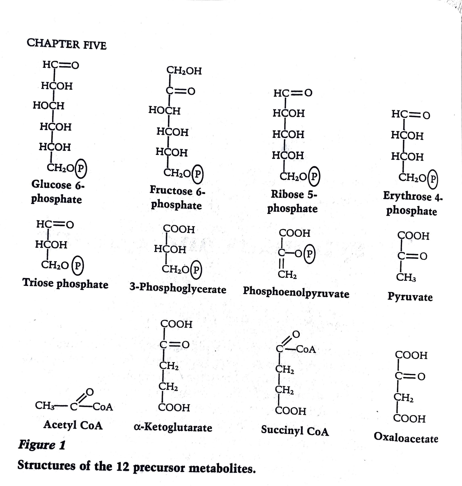
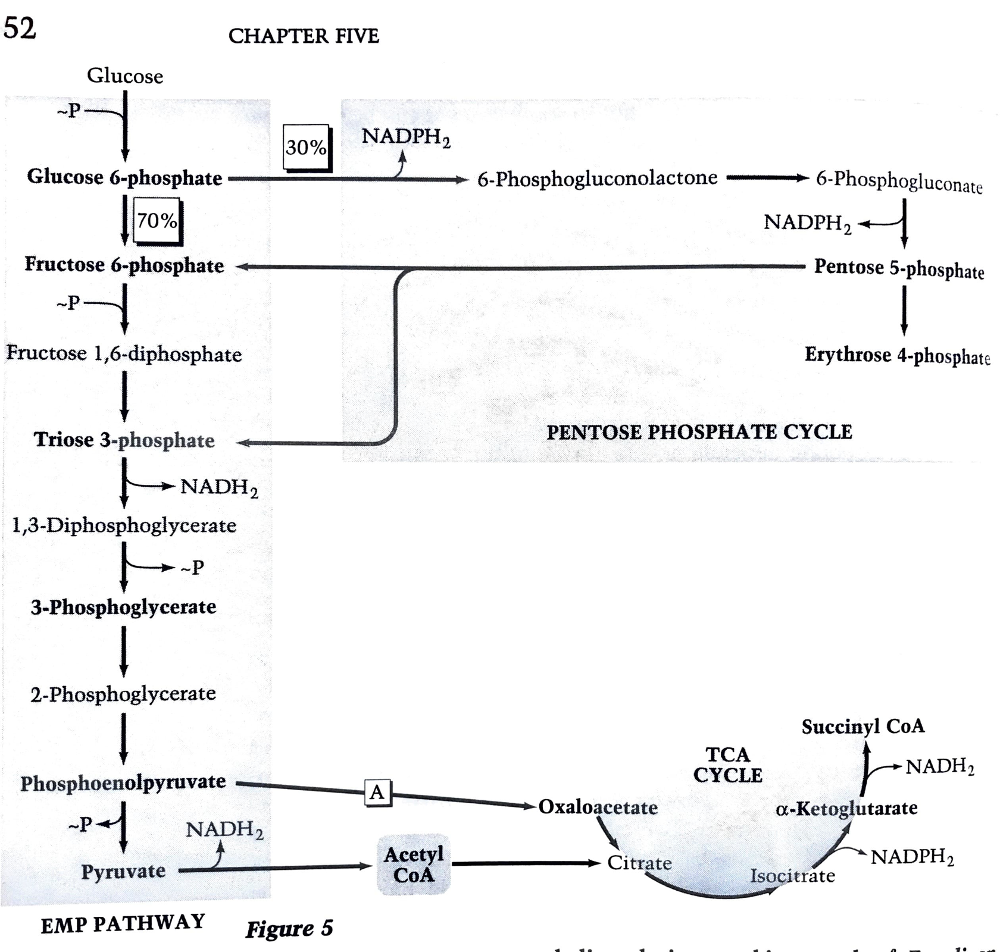
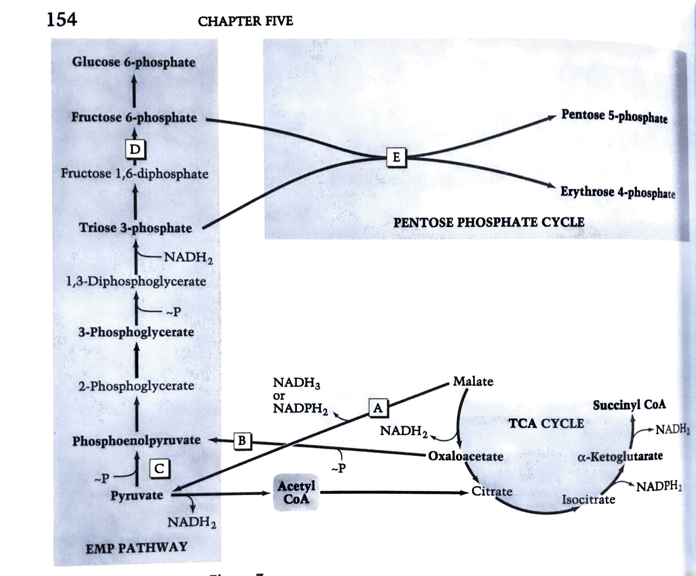
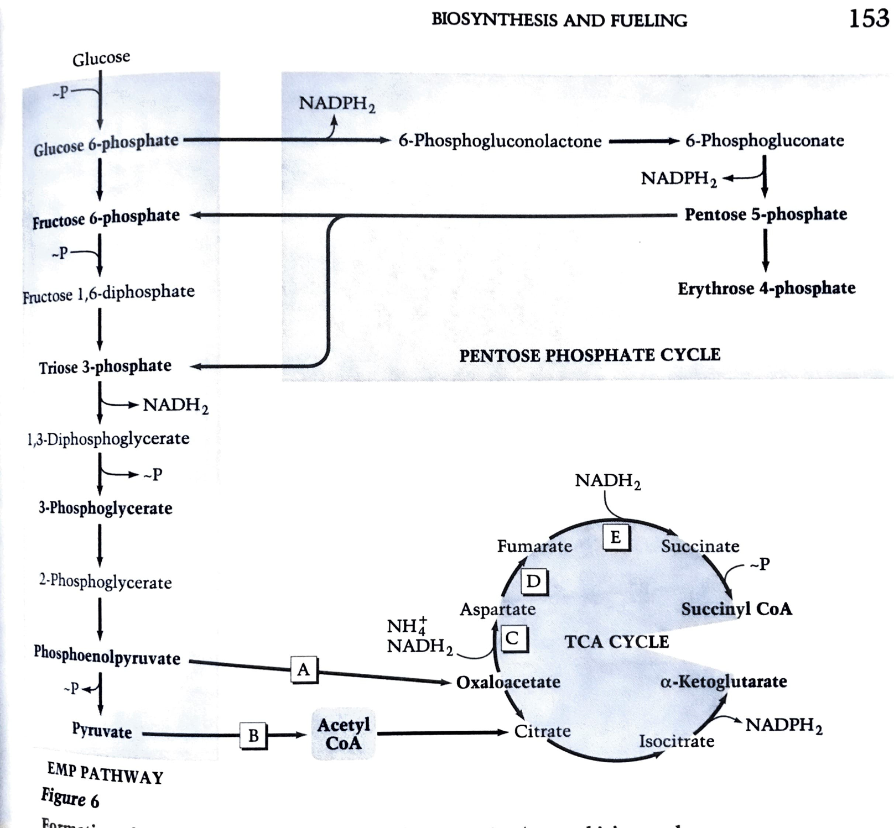
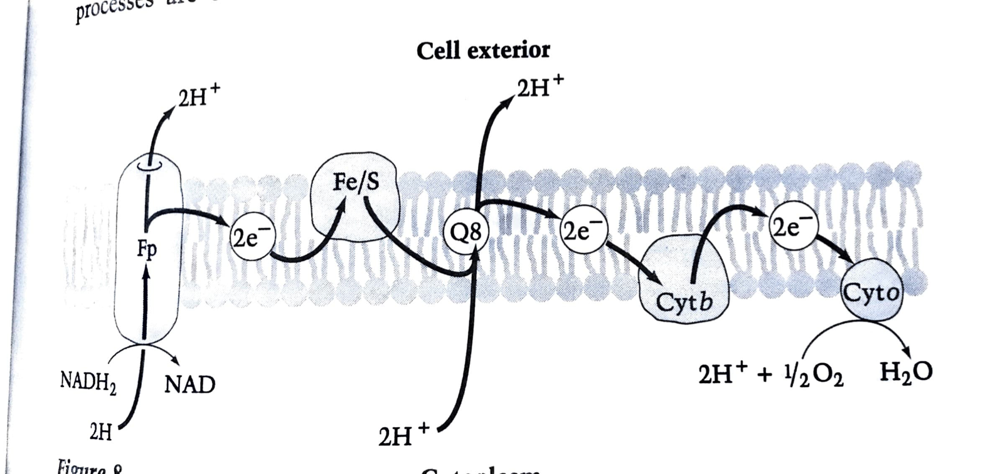
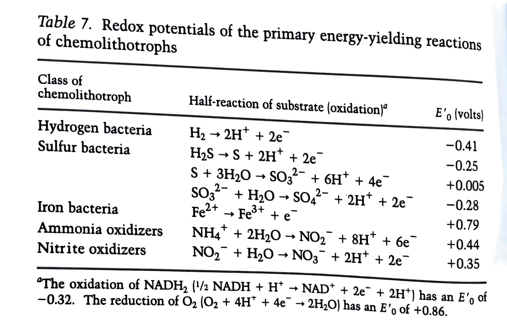
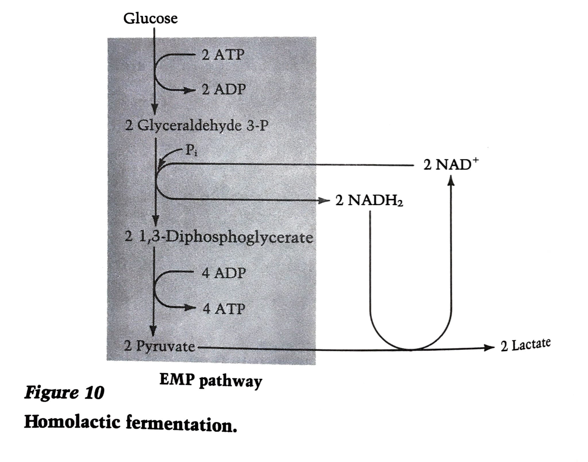
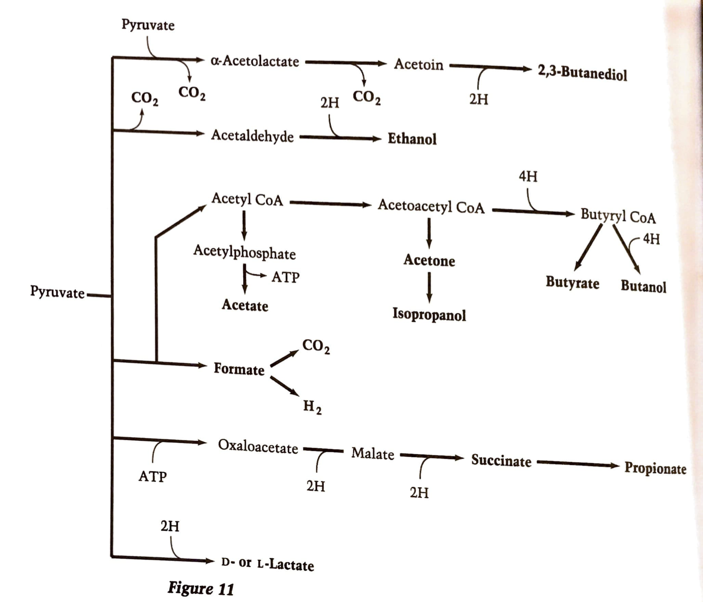
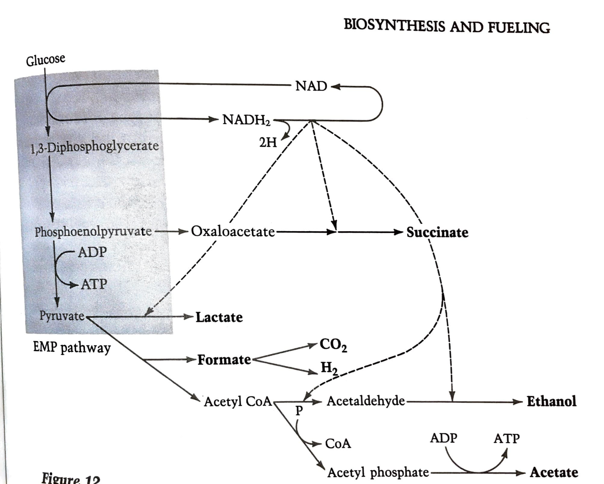
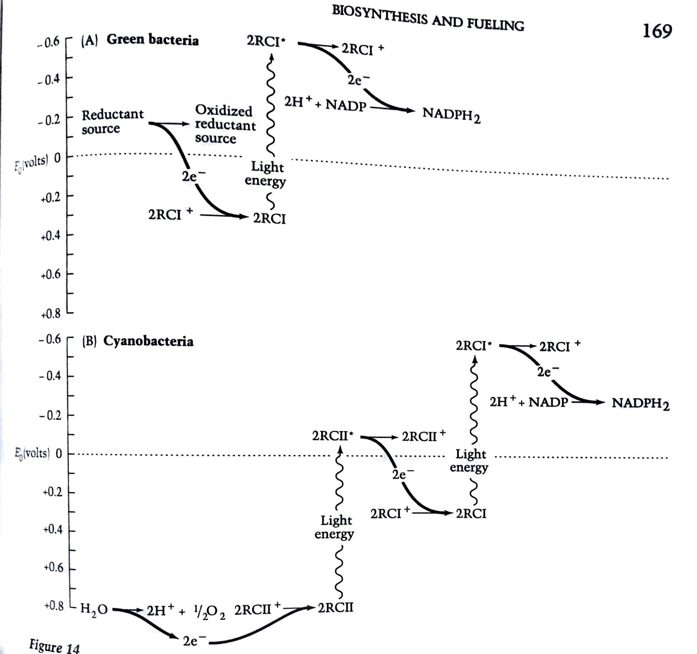

```{r setup, include=FALSE}
knitr::opts_chunk$set(echo = FALSE)
library(tidyverse)
library(readxl)
library(ggrepel)
```

## How do bacteria create themselves from components in the medium?

- Several hundred enzyme-catalyzed reactions. Can be subdivided into:
    - **Biosynthetic Pathways** - from 12 precursor metabolites to building blocks
    - **Fueling Pathways** - from ingredients of the medium to metabolic needs
    
## The 12 precursor metabolites
{ width=60% }

## Table 1 - Basic Building Blocks by mol
```{r}
table1 <- read_excel("NeidhardtChapter5_figures/chapter5_table1_building_blocks.xlsx")
```

```{r, out.height="80%", out.width="90%"}
table1 %>% filter(`umol/g` > 0) %>%
    mutate(building_block = fct_reorder(building_block, `umol/g`, max)) %>%
    mutate(class = fct_reorder(class, -`umol/g`, min)) %>%
    ggplot(aes(y = building_block, x = `umol/g`, fill = class)) + 
    scale_fill_brewer(palette = "Set1") +
    geom_col() + theme_bw() + labs(y = "", x = "umol/g", fill = "Class")
```

## Table 2 - Basic building block requirements
```{r}
pathways <- tibble(precursor = 
c("acCoA", "eryP","fruP","gluP","akg","oaa","penP", "pep","pga","pyr","triosP"),
pathway = c("Linker", "Pentose", "EMP", "EMP", "TCA", "TCA", "Pentose", "EMP", "EMP", "EMP", "EMP"))
```

```{r message=FALSE}
table1 %>% filter(`umol/g` > 0) %>%
    pivot_longer(acCoA:triosP, 
                 values_to = "precursor_count", names_to = "precursor") %>%
    mutate(precursor_total = precursor_count * `umol/g`) %>% 
    group_by(precursor) %>%
    summarize(sum = sum(precursor_total)) %>% inner_join(pathways, "precursor") %>%
    mutate(precursor = fct_reorder(precursor, sum)) %>%
    ggplot(aes(x = sum, y = precursor, fill = pathway)) + geom_col() +
    theme_bw() + labs(x = "Total umol/g precursor", y = "", fill = "Pathway")
```


## Table 1 - Basic building blocks by precursor
```{r}
table1 %>% filter(`umol/g` > 0) %>%
    mutate(building_block = fct_reorder(building_block, `umol/g`, max)) %>%
    mutate(class = fct_reorder(class, -`umol/g`, min)) %>%
    pivot_longer(acCoA:triosP, 
                 values_to = "precursor_count", names_to = "precursor") %>%
    mutate(precursor_total = precursor_count * `umol/g`) %>% 
    filter(precursor_total > 0) %>%
    ggplot(aes(x = precursor_total, y = building_block, fill = class)) +
    scale_fill_brewer(palette = "Set1") +
    geom_col() + facet_wrap(~precursor, scale = "free") + theme_bw() + 
    labs(y = "", x = "Precursor total umol/g") +
    theme(legend.position = c(0.9,0.1)) +
    guides(fill = guide_legend(ncol = 2))
```


## Table 1 - Basic building blocks by required ATP
```{r, out.height="80%", out.width="90%"}
table1 %>% filter(`umol/g` > 0) %>% mutate(ATP_total = ATP * `umol/g`) %>%
    mutate(class = fct_reorder(class, -`umol/g`, min)) %>%
    ggplot(aes(y = ATP_total, x = `umol/g`, color = class)) +
    geom_point() +
     scale_color_brewer(palette = "Set1") +
    geom_label_repel(data = . %>% filter(ATP_total > 500), aes(label = building_block), show.legend = FALSE) +
 theme_bw() + labs(y = "Total umol of ATP required", x = "umol/g",color = "Class")
```

## Table 1 - Basic building blocks by required NADPH
```{r, out.height="80%", out.width="90%"}
table1 %>% filter(`umol/g` > 0) %>% mutate(NADPH_total = NADPH * `umol/g`) %>%
    mutate(class = fct_reorder(class, -`umol/g`, min)) %>%
    ggplot(aes(y = NADPH_total, x = `umol/g`, color = class)) +
    geom_point() +
     scale_color_brewer(palette = "Set1") +
    geom_label_repel(data = . %>% filter(NADPH_total > 500), aes(label = building_block), show.legend = FALSE) +
 theme_bw() + labs(y = "Total umol of NADPH required", x = "umol/g",color = "Class")
```

## Table 1 - Basic building blocks by required $NH_4^+$
```{r, out.height="80%", out.width="90%"}
table1 %>% filter(`umol/g` > 0) %>% mutate(NH4_total = `NH4+` * `umol/g`) %>%
    mutate(class = fct_reorder(class, -`umol/g`, min)) %>%
    ggplot(aes(y = NH4_total, x = `umol/g`, color = class)) +
    geom_point() +
     scale_color_brewer(palette = "Set1") +
    geom_label_repel(data = . %>% filter(NH4_total > 500), aes(label = building_block), show.legend = FALSE) +
 theme_bw() + labs(y = "Total umol of NH4+ required", x = "umol/g",color = "Class")
```

## Table 1 - Basic building blocks by required S
```{r, out.height="80%", out.width="90%"}
table1 %>% filter(`umol/g` > 0) %>% mutate(S_total = `S` * `umol/g`) %>%
    mutate(class = fct_reorder(class, -`umol/g`, min)) %>%
    ggplot(aes(y = S_total, x = `umol/g`, color = class)) +
    geom_point() +
     scale_color_brewer(palette = "Set1") +
    geom_label_repel(data = . %>% filter(S_total > 50), aes(label = building_block), show.legend = FALSE) +
 theme_bw() + labs(y = "Total umol of S required", x = "umol/g",color = "Class")
```

## Assimilation of Nitrogen - organic sources
- None of the 12 precursor metabolites contain nitrogen or sulfur
- Most organic sources have N in the -3 oxidation state
    - Amino groups
    - Imino groups
    - heterocyclic nitrogen atoms
- These get metabolized by bacteria into $NH_4^+$
- Enzymes that catalyze pathways leading to $NH_4^+$ are usually genetically controlled
    - They are off when plenty of $NH_4^+$ is around

## Assimilation of Nitrogen - inorganic sources
- Most significant inorganic sources are:
    - $NH_4^+$
    - $NO_3^-$ (*E. coli* only anaerobically)
    - $N_2$ (*E. coli* cannot use this)
- Utilization of $NO_3^-$ uses two reactions
    - $NO_3^- \rightarrow NO_2^-$ by Assimilatory Nitr**a**te Reductase
    - $NO_2^- \rightarrow NH_4^+$ by Assimilatory Nitr**i**te Reductase
- $NO_3^-$ can also be used as the terminal electron acceptor in respiration
    - Anaerobic respiration
    - *E. coli* can do this
- Nitrogen fixation ($N_2 \rightarrow NH_4^+$)
    - Nitrogenase - combination of two iron-sulfur proteins
    - Azoferredoxin
    - Molybdoferredoxin (has two molybdenum atoms as well)

## Assimilation of Nitrogen - $NH_4^+ \rightarrow$ organic compounds
- Large diversity in obtaining $NH_4^+$ but only two ways to utilize it
- Directly into glutamate by L-Glutamate Dehydrogenase (GDH)
- Indirectly by a cycle of reactions (GS-GOGAT)
    - Glutamine synthetase (GS)
    - Glutamate Synthase (glutamate-$\alpha$-oxoglutarate aminotransferase, GOGAT)
- Reaction is basically the same though ($\alpha$-ketoglutarate + $NH_4^+ \rightarrow$ glutamate)
- Major differences between GDH and GS
    - GS has higher affinity for ammonia than GDH
    - GS-catalyzed reaction needs ATP whereas GDH doesn't
- Organisms that have both (like *E. coli*) can balance energy with nitrogen needs
    - GS is turned off if ammonia is high
    - GS is also inhibited by eight compounds derived from glutamine
    - GS is also post-translationally modified by adenylation (on/off controlled by one enzyme)
        - Controlled by ratio of glutamine to $\alpha$-ketoglutarate

## Assimilation of Sulfur - $H_2S \rightarrow$ cysteine
- Major reaction is O-acetylserine sulfohydrolase
    - $H_2S$ + O-acetylserine + $\rightarrow$ cysteine + acetate + water
- Any other source of sulfur must be converted to $H_2S$ to be used
- $H_2S$ is only really in anaerobic environments
- Sulfate is the most common source in the lab (probably not in environment though)
- Bulk of S probably comes in through C-bonded S in organic compounds
- Enzymes that can use sulfates are turned on by organic sulfates

## Assimilation of Phosphorus - phosphate $\rightarrow$ ATP
- Differs from nitrogen and sulfur in two key aspects
    - Is not oxidized or reduced
    - Assimilated through fueling pathways instead of biosynthesis
- Organic phosphate compounds don't usually penetrate the cell membrane
- Hydrolysis of organic phosphates is driven by akaline phosphatase in the periplasm
- Akaline phosphatase is repressed when phosphate is in the medium
- *E. coli* also has a 5$'$ nucleotidase that acts in the periplasm
- Free phosphate is taken up into ATP

## Nutritional diversity - How specialized is a bug?
- Bacteria can take advantage of preformed building blocks
- **Auxotrophs** lack one or more biosynthetic pathways
- **Prototrophs** are "complete biochemists" (like *E. coli*)
- Reciprocal relationship between biosynthetic capability and nutritional requirements
- Those with rich growth environments tend to do away with unnecessary pathways

## Table 4 - Biosynthesis costs in rich medium
::: columns

:::: column
```{r}
table4 <- tibble(component = c("Protein", "RNA", "DNA", "Lipid", "LPS",
                               "Murein", "Glycogen", "1-Carbon",
                               "Polyamines"),
                 `umol ~ P/g cells` = c(0, 1890, 300, 129, 125, 55,
                                        154, 0, 118))
```

```{r, fig.height = 5, fig.width = 4}
table4 %>% mutate(component = fct_reorder(component, `umol ~ P/g cells`)) %>%
    ggplot(aes(x = `umol ~ P/g cells`, y = component, fill = component)) +
    geom_col(show.legend = FALSE) + theme_bw(base_size = 20) + labs(y = "")
```

::::

:::: column

- Medium has
    - glucose and inorganic salts
    - 21 amino acids, ribonucleosides, deoxyribonucleosides
    - glycerol phosphate, fatty acids, ornithine, glucosamine, ethanolamine, heptose, KDO
- 85% of the energy and 100% of reducing power is saved by harvesting from media
- These costs swing even more wildly depending on carbon source

::::

:::

## Fueling reactions - where bacteria show their diversity
- Biosynthesis is basically the same in all bacteria
- Goal is to create the 12 precursor metabolites/energy
- These reactions are typically called central metabolism

{ width=60% }

## Fueling reactions - *E. coli* central metabolism by carbon source 
::: columns

:::: column
Glucose


::::

:::: column
Malate

::::
:::


## Fueling reactions - Energy cost by carbon source
```{r}
table5 <- read_excel("NeidhardtChapter5_figures/chapter5_table5_energy_costs.xlsx")
```

```{r, warning=FALSE}
table5 %>% mutate(precursor = fct_reorder(precursor, `umol/g`)) %>%
    pivot_longer(P:CO2, names_to = "energy_molecule", values_to = "umol") %>%
    mutate(total_energy = `umol/g` * umol) %>%
    ggplot(aes(y = precursor, x = total_energy, fill = substrate)) + 
    geom_col(position = "dodge") + labs(x = "umol/g", y = "", fill = "Substrate") + 
    geom_vline(xintercept = 0, linetype = "dashed") + 
    geom_hline(yintercept=seq(1.5, length(unique(table5$precursor))-0.5, 1), 
             lwd=0.25, colour="grey") +
    theme_bw() + facet_wrap(~energy_molecule) + theme(panel.grid = element_blank())
```

## Fueling strictly for precursors is not enough
```{r, message=FALSE, fig.height=2.5, fig.width=4}
table5 %>% 
    pivot_longer(P:CO2, names_to = "energy_molecule", values_to = "umol") %>%
    mutate(total_energy = `umol/g` * umol) %>%
    group_by(substrate, energy_molecule) %>%
    summarize(overall_energy = sum(total_energy, na.rm = TRUE)) %>%
    ungroup() %>%
    ggplot(aes(y = substrate, x = overall_energy, fill = substrate)) +
    geom_col(show.legend=FALSE) + facet_wrap(~energy_molecule) + theme_bw() + 
    geom_vline(xintercept = 0, linetype = "dashed") +
    labs(y = "", x = "umol/g", fill = "Substrate")
```

- Malate: net energy needed, Glucose: net energy produced
- Need 42,703 $\mu$mol of ~P
    - 24,218 for polymerization (Chapter 4)
    - 18,485 for biosynthesis (Chapter 5)

## Fermentation vs. Respiration - what do I do with all these reduced pyridine nucleotides?
- **Fermentation** - reoxidation through reducing organic metabolites
- **Respiration** - reoxidation through electron transport
    - Does **not** neccesarily need oxygen (anaerobic respiration)
- Oxygen does play into what pathways are used by a cell
    - **Strict Aerobes** - only grow in oxygen
    - **Anaerobes** - only grow without oxygen
    - **Faculative Anaerobes** - can grow in +/- oxygen
    - **Indifferent Anaerobes** - make ATP by fermentation regardless of oxygen

## *E. coli* - oxygen presence changes flow through central metabolism
::: columns

:::: column 

Aerobic


::::

:::: column

Anaerobic


::::

:::

## *E. coli* - Electron transport chain



- Major energy production with $O_2$ as the acceptor

## Electron transport chain in other bacteria
- **Chemolithotrophs** - generate ATP but uncoupled from NAD reduction
- Use reverse electron transport to reduce NAD
- Hydrogen bacteria couple substrate oxidation directly to reduction of NAD



## Utilization of oxygen - what is needed?
- A lack of enzymes that are intrinisically sensitive to oxygen
- The ability to break down hydrogen peroxide ($H_2O_2$) and superoxide($O\cdot_2^-$)
- Some aerobes have enzymes that are sensitive to $O_2$
    - *Azotobacter* respires fast enough to protect its nitrogenase
    - Cyanobacteria have heterocysts to contain nitrogenase in an anaerobic pocket
- Catalase - $2H_2O_2 \rightarrow 2H_2O + O_2$
- Superoxide dismutase - $2O\cdot_2^- + 2H^+ \rightarrow O_2 + H_2O_2$

## Fermentation - making ATP and oxidizing NADH $\rightarrow$ NAD+



- ATP made through substrate-level phosphrylation
- Strict redox balance is maintained
- Since you need both oxidation and reduction subtrates are usually intermediate
in redox (i.e. sugars)
- Since energy yield is low you need alot of substrate. Carbon can be harvested
from fermentation end products
- Pyruvate usually involved but end products are different

## Fermentation - the diversity of end products



## Fermentation - *E. coli* and mixed acid fermentation



## Table8 - Carbon flux and redox balance during *E. coli* fermentation in glucose

::: columns

:::: column 

```{r}
table8 <- read_excel("NeidhardtChapter5_figures/chapter5_table8_mixed_acid.xlsx")
```

```{r warning=FALSE, fig.height = 4, fig.width = 4}
table8 %>% mutate(Product = fct_reorder(Product, `mol C`)) %>%
    ggplot(aes(y = Product, x = `mol C`, fill = Product)) + 
    geom_col(show.legend = FALSE) + theme_bw() +
    labs(x = "mol C/ 100 mol Glucose", y = "")
```

::::

:::: column

```{r warning=FALSE, fig.height = 4, fig.width = 4}
table8 %>% mutate(Product = fct_reorder(Product, `mol C`)) %>%
    mutate(`O/R total` = `O/R value` * `mol/100 mol glucose`) %>%
    ggplot(aes(y = Product, x = `O/R total`, fill = Product)) + 
    geom_col(show.legend = FALSE) + geom_vline(xintercept = 0, linetype = "dashed") +
    theme_bw() + labs(y = "")
```
::::

:::

## Phototrophs and their fueling reactions
- **Oxygenic** photosynthesis - cyanobacteria and blue-green bacteria
- **Anoxygenic** photosynthesis - purple bacteria, purple-sulfur, green bacteria
-  Cyclic photophosphorylation - basically ETC but using light as the energy source
    - Chlorophyll is the electron donor and acceptor
    - Membrane-bound so have increased cytoplasmic membrane
- Photosynthetic aparatus
    - light-harvesting antenna
    - reaction center
    - ETC
    
## Sources of reducing power in phototrophs

{ height=60% }

- Since NADH/NADPH is not used, phototrophs reduce NADP in different ways
    - Purple nonsulfur use organic compounds or $H_2$
    - Purple sulfur and green use reduced sulfur
    - oxygenic cyanobacteria use water and produce $O_2$

## Phototrophs - Formation of precursors
- Synthesize precursors through $CO_2$
- Green bacteria fix $CO_2$ by reversing the TCA cycle
- Other phototrophs fix $CO_2$ by the Calvin-Benson pathway
    - Uses ribulosebisphosphate carboxylase (may be most abundant enzyme on earth)
    - Utilizes ATP and reduced NADP rather than generating them
- Fueling is done through photosynthesis
- Fueling for chemolithotrophs is done through aerobic respiration of inorganic
substrate

